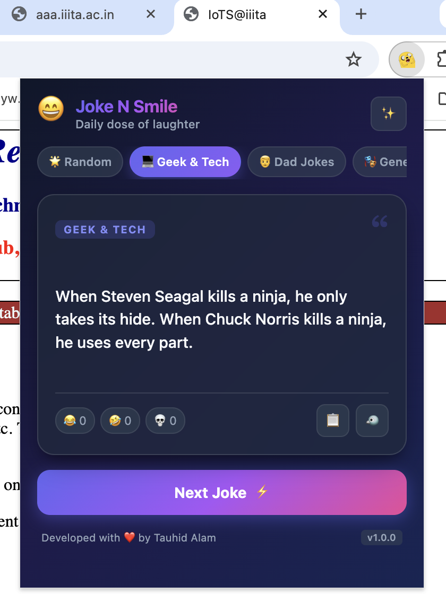
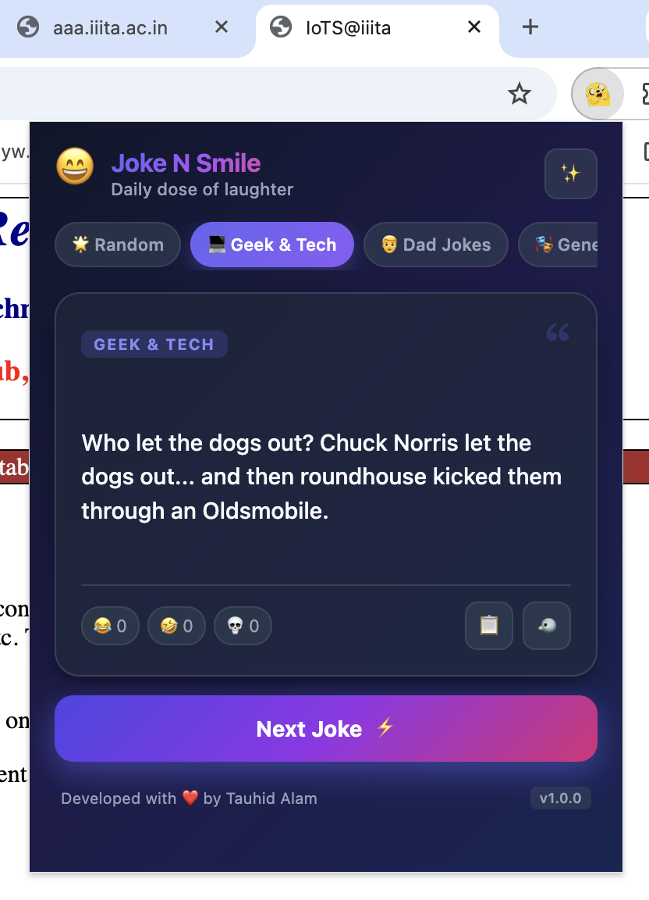
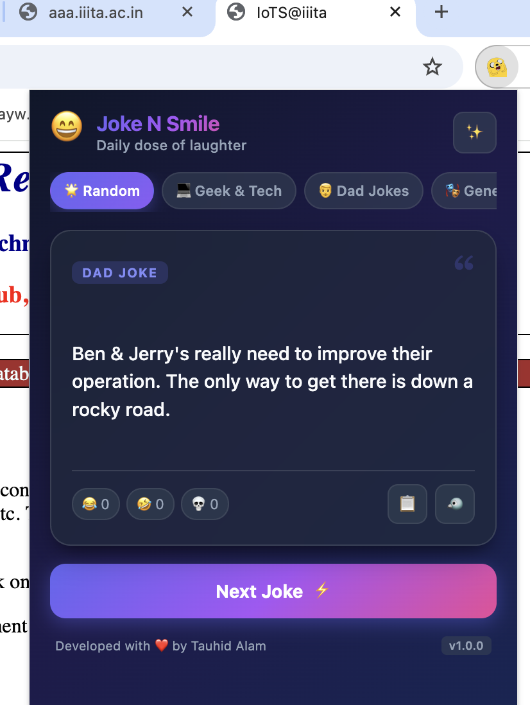
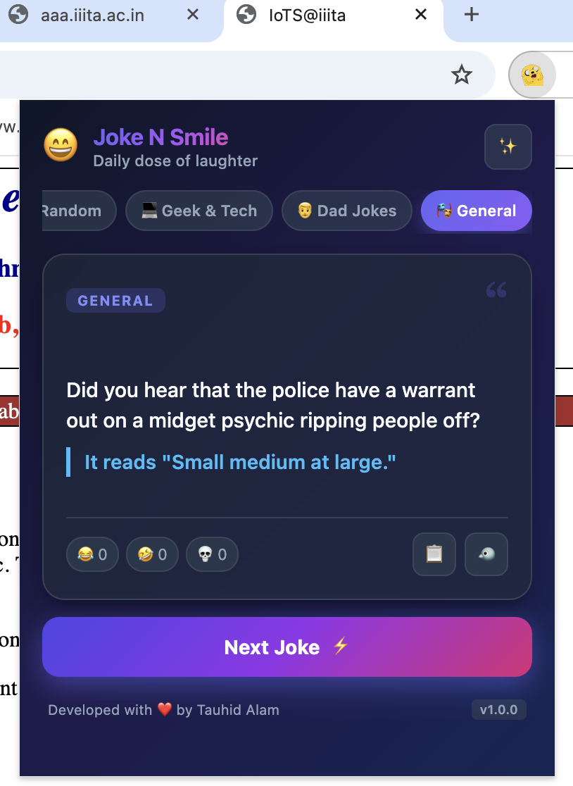
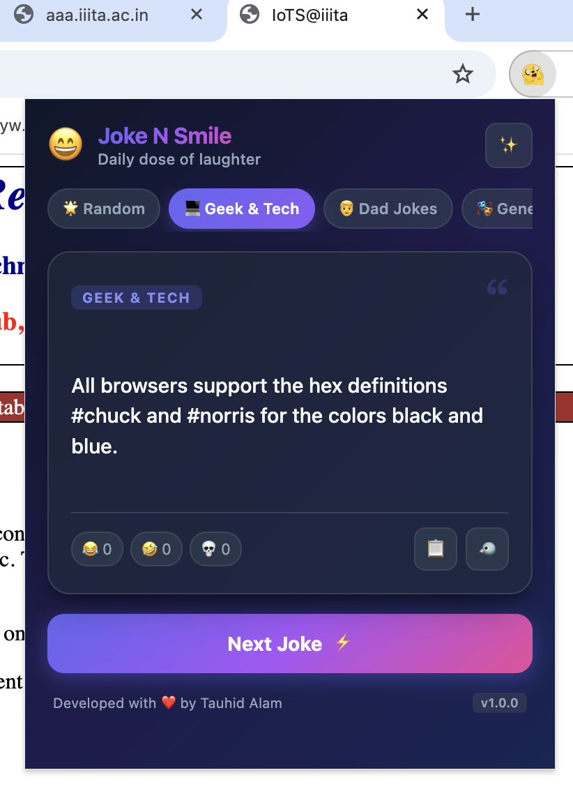
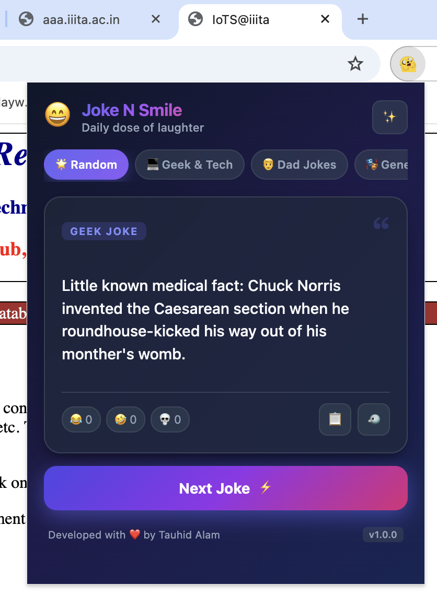
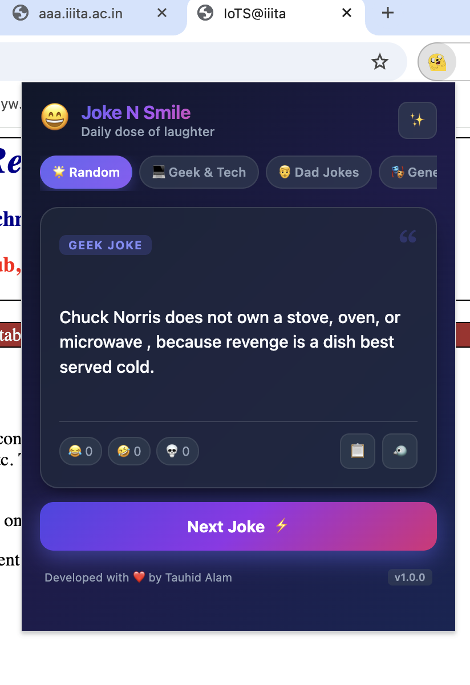

# 😄 Joke N Smile N Laugh

A modern, fast, and sleek Google Chrome Extension that brings an instant dose of laughter, wit, and energy right to your browser toolbar.

---

## 📸 Preview & Screenshots

<p align="center">
  
</p>

### 🎭 Category Previews

| 💻 Geek & Tech Mode | 👨 Dad Jokes Mode |
| :---: | :---: |
|  |  |

| 🎭 General Humor | ⚡ Developer Humor |
| :---: | :---: |
|  |  |

| 🎲 Random Mode | 🥋 Chuck Norris Humor |
| :---: | :---: |
|  |  |

---

## ✨ Features

- **⚡ Multiple Joke Categories**:
  - **Random**: Surprise jokes across various styles and genres.
  - **Geek & Tech**: Programming, Chuck Norris, IT, and nerd humor.
  - **Dad Jokes**: Wholesome, pun-filled, classic dad jokes.
  - **General**: Two-part setups and clever punchlines.
- **🎨 Modern Glassmorphic UI**: Sleek dark-mode aesthetic with fluid gradients, backdrop blur, and micro-animations.
- **📋 One-Click Copy**: Copy any joke to your clipboard with instant visual feedback.
- **🐦 Share to X / Twitter**: Easily share jokes directly to X/Twitter.
- **😂 Interactive Emoji Reactions**: Live counters for 😂, 🤣, and 💀 reactions.
- **🛡️ Built-in Offline Backup**: Built-in curated offline joke database ensures continuous enjoyment even without an internet connection.
- **🚀 Chrome Manifest V3**: Fully compliant with the latest Google Chrome Extension standards.

---

## 🛠️ Built With

- **HTML5 & Vanilla CSS3**: Custom glassmorphism design system without heavy external dependencies.
- **Vanilla JavaScript (ES6+)**: Async/await API handling, clipboard interaction, and UI state management.
- **Chrome Extension API (Manifest V3)**: Fast and lightweight browser integration.
- **Integrated Joke APIs**:
  - Geek Jokes API
  - Official Joke API
  - icanhazdadjoke API

---

## 🚀 How to Install and Run Locally

1. **Download / Clone** this repository:
   ```bash
   git clone https://github.com/tauhidalamx/JokeNsmileNlaughx.git
   ```
2. Open Google Chrome (or any Chromium browser like Brave, Edge, Opera).
3. Navigate to:
   ```text
   chrome://extensions
   ```
4. Enable the **Developer mode** toggle in the top-right corner.
5. Click **Load unpacked** in the top-left corner.
6. Select the cloned folder.
7. **Pin 📌** the extension in your browser toolbar and click the icon to enjoy your daily dose of laughs!

---

## ⌨️ Keyboard Shortcuts

| Shortcut | Action |
| :--- | :--- |
| <kbd>Space</kbd> / <kbd>Enter</kbd> | Fetch next joke instantly |

---

## 📁 Project Structure

```text
JokeNsmileNlaughx/
├── manifest.json       # Manifest V3 configuration
├── popup.html          # Extension popup UI
├── style.css           # Styling and animations
├── script.js           # Joke fetchers and interaction logic
├── logo.png            # Extension toolbar icon
├── LICENSE             # MIT License
├── ss/                 # Screenshot assets
│   ├── 1.png
│   ├── 2.png
│   ├── 3.png
│   ├── 4.png
│   ├── 5.png
│   ├── 6.png
│   ├── 7.png
│   └── 8.png
├── .gitignore          # Git ignore rules
└── README.md           # Documentation
```

---

## 👨‍💻 Developed by

**Tauhid Alam**  
GitHub: [@tauhidalamx](https://github.com/tauhidalamx)
